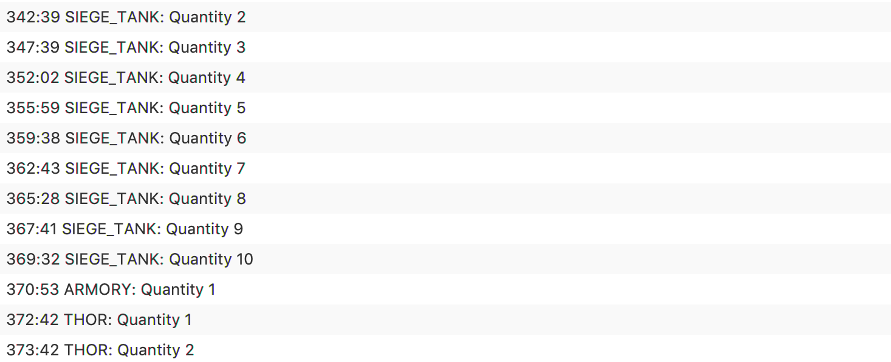
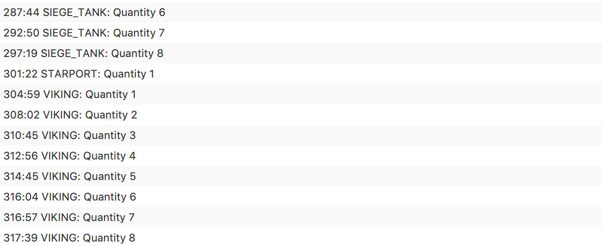
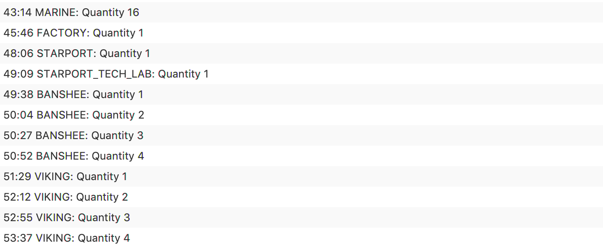
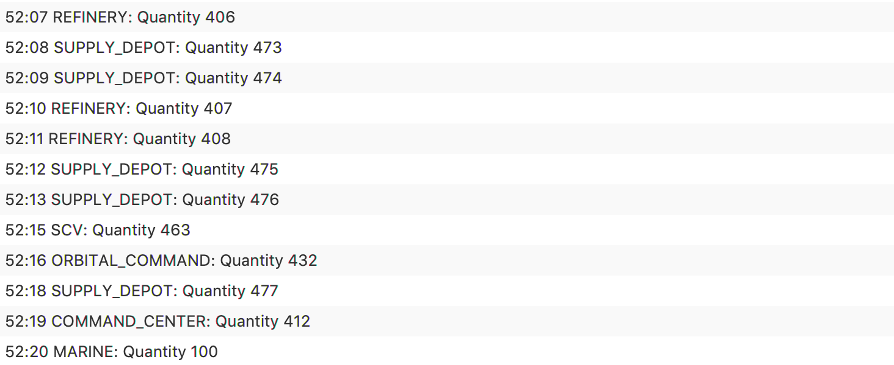

# Starcraft

## Overview 

The specification required that a simulator and build order optimiser be produced. The program should simulate a Starcraft II game from a single players perspective and should suggest ways in which a player could reach specified game states. 

#### Assumptions: 

#### Problem Decomposition:

## Design 

#### Analysis of optimisation strategy - Monte Carlo Tree Search:

## Testing 

##### Test 1: 

This test was used to ensure that the program produces build order for 6 marines: 

###### Expected 

The program shoud produce a build order which outlines the best method in which to build six marines. 

###### Actual 

The program successfully produced a build order for 6 marines

##### Test 2: 

This test was used to ensure that the program produces build order for 16 marines: 

###### Expected 

The program should produce a build order which outlines a build order for 16 marines and the time it takes to build the 16 marines using that specific build order. 

###### Actual 

The program successfully produces a build order for 16 marines

##### Test 3: 

This test was used to ensure that the program produces build order for 50 marines: 

###### Expected 

The program should produce a build order which outlines a build order for 50 marines and the time it takes to build the 50 marines using that specific build order. 

###### Actual 

The program successfully produces a build order for 50 marines

##### Test 4: 

This test was used to ensure that the program produces build order for 10 hellions: 

###### Expected 

The program should produce a build order which outlines a build order for 10 hellions and the time it takes to build the 10 hellions using that specific build order. 

###### Actual 

The program successfully produces a build order for 10 hellions.

##### Test 5: 

This test was used to ensure that the program produces build order for 6 marines and 4 hellions: 

###### Expected 

The program should produce a build order which outlines a build order for 6 marines and 4 hellions and the time it takes to build the 6 marines and 4 hellions using that specific build order. 

###### Actual 

The program successfully produces a build order for 6 marines and 4 hellions.

##### Test 6

This test was used to ensure that the program produces build order for 8 marines and 2 medivacs: 

###### Expected 

The program should produce a build order which outlines a build order for 8 marines and 2 medivacs and the time it takes to build the 8 marines and 2 medivacs using that specific build order. 

###### Actual 

The program successfully produces a build order for 8 marines and 2 medivacs 

##### Test 7

This test was used to ensure that the program produces build order for 8 marines, 2 medivacs and 2 vikings: 

###### Expected 

The program should produce a build order which outlines a build order for 8 marines, 2 medivacs and 2 vikings and the time it takes to build the 8 marines, 2 medivacs and 2 vikings using that specific build order. 

###### Actual 

The program successfully produces a build order for 8 marines, 2 medivacs and 2 vikings.

##### Test 8: 

This test was used to ensure that the program produces build order for 16 Marines, 8 Hellions and 3 Medivacs: 

###### Expected 

The program should produce a build order which outlines a build order for 16 Marines, 8 Hellions and 3 Medivacs and the time it takes to build the 16 Marines, 8 Hellions and 3 Medivacs using that specific build order. 

###### Actual 

The program successfully produces a build order for 16 Marines, 8 Hellions and 3 Medivacs.

#### Advanced Goals

##### Test 9

This test was used to ensure that the program produces a build order to that outlines how to build: 2 Marines, 8 Hellions, 10 Siege Tanks and 2 Thors. 

###### Expected

The program should output an optimal build order that shows how 2 Marines, 8 Hellions, 10 Siege Tanks and 2 Thors can be produced in a shown time. 

###### Actual

The program successfully produces a build order that outlines how to create 2 Marines, 8 Hellions, 10 Siege Tanks and 2 Thors. 

##### Test 10

This test was used to ensure that the program produces a build order to that outlines how to build: 16 Marines and 8 Marauders. 

###### Expected

The program should output an optimal build order that shows how 16 Marines and 8 Marauders can be produced in a shown time. 

###### Actual

The program successfully produces a build order that outlines how to create 16 Marines and 8 Marauders. 

##### Test 11

This test was used to ensure that the program produces a build order to that outlines how to build: 16 Marines 8 Marauders and 4 Medivacs. 

###### Expected

The program should output an optimal build order that shows how 16 Marines 8 Marauders and 4 Medivacs can be produced in a shown time. 

###### Actual

##### Test 12

This test was used to ensure that the program produces a build order to that outlines how to build: 2 Marines, 3 Hellions, 8 Tanks and 8 Vikings. 

###### Expected

The program should output an optimal build order that shows how 2 Marines, 3 Hellions, 8 Tanks and 8 Vikings can be produced in a shown time. 

###### Actual

##### Test 13

This test was used to ensure that the program produces a build order to that outlines how to build: 16 Marines, 4 Banshees and 4 Vikings. 

###### Expected

The program should output an optimal build order that shows how 16 Marines, 4 Banshees and 4 Vikings can be produced in a shown time. 

###### Actual

#### Extension Testing:

##### Test 14 - Supply

This test was used to ensure that the program prevents the user from building, for example, 1000 marines as this exceeds the maximum supply level of 200

###### Expected

The program should display an error message as this amount (1000) of marines would use more than 200 supply. 

###### Actual

The program successfully displays an error message. 

##### Test 15 -  Orbital Command

This test was used to ensure that the program has the capability to upgrade Command Centers to Orbital Commands. In this test the program will try to produce the optimum build order for 100 marines.

###### Expected

The program should show use of orbital commands 

###### Actual

The program successfully upgrades command centers to orbital commands depending on completed barracks. 

## Evaluation 

The specification required that a simulator and build order optimiser be produced. It should simulate a Starcraft II game from a single players perspective and should produce ways in which a player can reach a specified game state. As shown from the testing above the program can successfully produce an optimised build order for both the 'Basic Goals' and 'Advanced Goals'. All extensions were also implemented. The program also makes use of a GUI to receive input from the user and output the build order. 

## Conclusion 

The specification was used successfully to produce a Starcraft II simulator and build optimiser. A genetic algorithm was used to continuously optimise the produced build order. 

##### Difficulties

##### With More Time

-  More test cases could have been implemented to further prove that the program meets the specification. 

