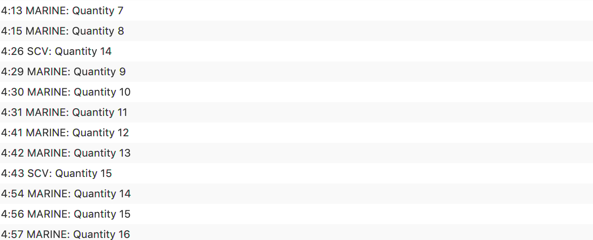
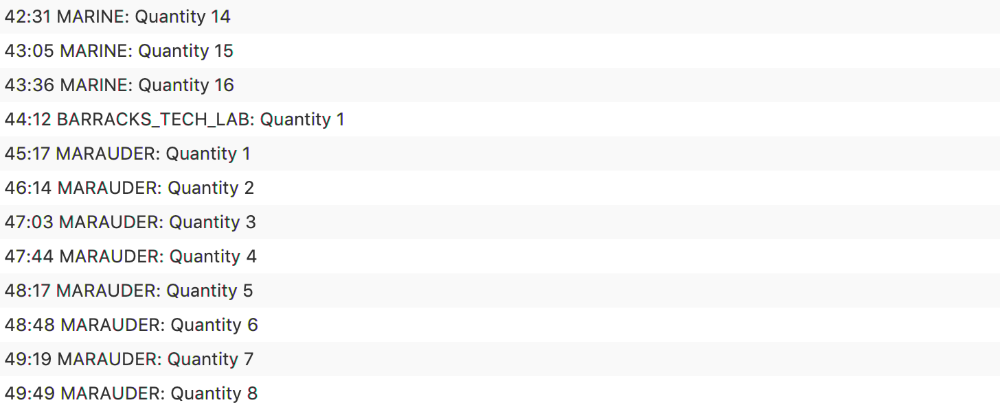

# Starcraft

## Overview 

The specification required that a simulator and build order optimiser be produced. The program should simulate a Starcraft II game from a single players perspective and should suggest ways in which a player could reach specified game states.  

### The following extensions were implemented

* Addition of resource suppply
* Tech lab and reactor addon
* All Unit types
* All Upgrades
* Orbital Command
* Mule
* Constructing buildings with workers
* Extra Bases and Base Depletetion
* Realistic Timing (adjustable game second)

#### Assumptions: 

* Ghost Academy and Fusion core are permanent upgrades <https://liquipedia.net/starcraft2/Ghost_Academy_(Legacy_of_the_Void)>

* contrary to specification and further supported by sources on:

  * barracks 
  * factory
  * starport

  support addons

* Buildings can only have one addon (supported by sources)

* There can be multiple mules on one patch

* Builds which cost over 200 supply can be instantly rejected as game this max supply.

* You require units to actually upgrade.

* The program can run infinitely it long update the current Optimal when it finds one;

#### Problem Decomposition:

* implement mechanism to find the possible decision
* implement mechanism to execute a decision
* implement way of represent of the game objects

## Design 

### Resource

All the gas resource shared command attributes of their gas and mineral cost and build time so a class was made to represent this. Then from there they were broken into smaller sub groups. Since all the units shall the exact same attributes they were generalised into a single class and all the different unit types were just instances of the Unit class. The same was done for upgrades and addons. Almost all the builds exist as just instances of a the building class but Command Center and Orbital Command which since both have special unique actions and properties were modelled into their own classes. It was decided that resource collection would be done via static methods from the Command Center as it would allow for resource to be collected for all the command centers and their bases and all for workers to be evenly distributed across of all the bases allow for maximum resource withdraw from patches. It was decided to model the Patches as class as they two had their own attributes such as the resource they had remaining and in the case of gas if it had a refinery or not. The attributes and functions Gas Patches and Mineral Patches shared in common were then generalise into a class from which then.

To be able to identify a resource a Use was made of Enum which were set to the name of the instances of the respective objects and also a `ResourceHandler` was made using case statements to return `new` instances of the resources. This allowed them to be ready used through out the program. As the object type could just be referenced directly from the enum.

### Search Strategy 

The search strategy used to find was a mixture of Heuristics and Random search. The program does not randomly assign workers but does it based on the demand for gas and minerals by the things it potential has to build. So when there is nothing with gas to build and especially when no refinery the program assigns all the workers to the mineral patches. Also the program only builds items which are dependencies of the units and upgrades it is attempting to build. This drastically reduces the search space allow for random search to become a viable option. Also to increase the been the random search is ran at. First a Worse Case solution is found by only building one of the each of the dependencies of the unit and not buy any workers and this becomes the maximum time a random search is able to go for. When a solution is ran again the length of the new solution becomes the new maximum for which the search shall run for.

It was round that when this algorithm would worker the algorithm would always over investing workers potentially increasing length of solution so it was decide, so they cap was the independent amount of amo, so they cap was the independent amount of amod to use a random number between (1-30) *multipled by Command Center that will be built as the maximum amount of workers which would allowed for shorter solution to be found. It was also determined via heuristic the maximum buildings required depending on what they were building. Ghost academy and Fusion Core  were if they were a dependence capped at 1 since they unlocked permanent upgrades. Engineering bays had a global cap of 2 as they could only build Infantry Armor and Infantry Weapons concurrently. Amoury was capable at 4 with similar logic.

### GUI

To present the information and allow for input JavaFX was used. This allowed for a easy format for the user to be able to input data and a easy way for the data to be outputted. 

### Multithreading

To allow the `GUI` to and optimisation algorithm to exist concurrently use was made of multi threading. When the use wanted to find a solution a new thread would be created and would allow for the calculation to run independently of the GUI, but occasionally there seen to be access conflict error when trying to update items from GUI from instead the thread. So the use of a try catch to make thread fill the `listview `when the resource is not busy. Also to stop the input from continuous flashing so fast user can not see it is on update via a buffer at regular intervals

## Testing 

##### Test 1: 

This test was used to ensure that the program produces build order for 6 marines: 

###### Expected 

The program shoud produce a build order which outlines the best method in which to build six marines. 

###### Actual 

The program successfully produced a build order for 6 marines

##### Test 2: 

This test was used to ensure that the program produces build order for 16 marines: 

###### Expected 

The program should produce a build order which outlines a build order for 16 marines and the time it takes to build the 16 marines using that specific build order. 

###### Actual 

The program successfully produces a build order for 16 marines

##### Test 3: 

This test was used to ensure that the program produces build order for 50 marines: 

###### Expected 

The program should produce a build order which outlines a build order for 50 marines and the time it takes to build the 50 marines using that specific build order. 

###### Actual 

The program successfully produces a build order for 50 marines

##### Test 4: 

This test was used to ensure that the program produces build order for 10 hellions: 

###### Expected 

The program should produce a build order which outlines a build order for 10 hellions and the time it takes to build the 10 hellions using that specific build order. 

###### Actual 

The program successfully produces a build order for 10 hellions.

##### Test 5: 

This test was used to ensure that the program produces build order for 6 marines and 4 hellions: 

###### Expected 

The program should produce a build order which outlines a build order for 6 marines and 4 hellions and the time it takes to build the 6 marines and 4 hellions using that specific build order. 

###### Actual 

The program successfully produces a build order for 6 marines and 4 hellions.

##### Test 6

This test was used to ensure that the program produces build order for 8 marines and 2 medivacs: 

###### Expected 

The program should produce a build order which outlines a build order for 8 marines and 2 medivacs and the time it takes to build the 8 marines and 2 medivacs using that specific build order. 

###### Actual 

The program successfully produces a build order for 8 marines and 2 medivacs 

##### Test 7

This test was used to ensure that the program produces build order for 8 marines, 2 medivacs and 2 vikings: 

###### Expected 

The program should produce a build order which outlines a build order for 8 marines, 2 medivacs and 2 vikings and the time it takes to build the 8 marines, 2 medivacs and 2 vikings using that specific build order. 

###### Actual 

The program successfully produces a build order for 8 marines, 2 medivacs and 2 vikings.

##### Test 8: 

This test was used to ensure that the program produces build order for 16 Marines, 8 Hellions and 3 Medivacs: 

###### Expected 

The program should produce a build order which outlines a build order for 16 Marines, 8 Hellions and 3 Medivacs and the time it takes to build the 16 Marines, 8 Hellions and 3 Medivacs using that specific build order. 

###### Actual 

#### Extension Testing:

##### Test 9 - Supply

This test was used to ensure that the program prevents the user from building, for example, 1000 marines as this exceeds the maximum supply level of 200

###### Expected

The program should display an error message as this amount (1000) of marines would use more than 200 supply. 

###### Actual

The program successfully displays an error message. 

##### Test 10 -  Orbital Command

This test was used to ensure that the program has the capability to upgrade Command Centers to Orbital Commands. In this test the program will try to produce the optimum build order for 100 marines.

###### Expected

The program should show use of orbital commands 

###### Actual

The program successfully upgrades command centers to orbital commands depending on completed barracks. 

#### Advanced Goals

##### Test 11

This test was used to ensure that the program produces a build order to that outlines how to build: 2 Marines, 8 Hellions, 10 Siege Tanks and 2 Thors. 

###### Expected

The program should output an optimal build order that shows how 2 Marines, 8 Hellions, 10 Siege Tanks and 2 Thors can be produced in a shown time. 

###### Actual

##### Test 12

This test was used to ensure that the program produces a build order to that outlines how to build: 16 Marines and 8 Marauders. 

###### Expected

The program should output an optimal build order that shows how 16 Marines and 8 Marauders can be produced in a shown time. 

###### Actual

##### Test 13

This test was used to ensure that the program produces a build order to that outlines how to build: 16 Marines 8 Marauders and 4 Medivacs. 

###### Expected

The program should output an optimal build order that shows how 16 Marines 8 Marauders and 4 Medivacs can be produced in a shown time. 

###### Actual

##### Test 14

This test was used to ensure that the program produces a build order to that outlines how to build: 2 Marines, 3 Hellions, 8 Tanks and 8 Vikings. 

###### Expected

The program should output an optimal build order that shows how 2 Marines, 3 Hellions, 8 Tanks and 8 Vikings can be produced in a shown time. 

###### Actual

##### Test 15

This test was used to ensure that the program produces a build order to that outlines how to build: 16 Marines, 4 Banshees and 4 Vikings. 

###### Expected

The program should output an optimal build order that shows how 16 Marines, 4 Banshees and 4 Vikings can be produced in a shown time. 

###### Actual

## Evaluation 

The specification required that a simulator and build order optimiser be produced. It should simulate a Starcraft II game from a single players perspective and should produce ways in which a player can reach a specified game state. As shown from the testing above the program can successfully produce an optimised build order for both the 'Basic Goals' and 'Advanced Goals'. All extensions were implemented. The program also makes use of a GUI to receive input from the user and output the build order. 

## Conclusion 

The specification was used successfully to produce a Starcraft II simulator and build optimiser. This mainly involved implementing a genetic algorithm to continuously optimise the produced build order. 

##### Difficulties

##### With More Time

-  More test cases could have been implemented to further prove that the program meets the specification. 

